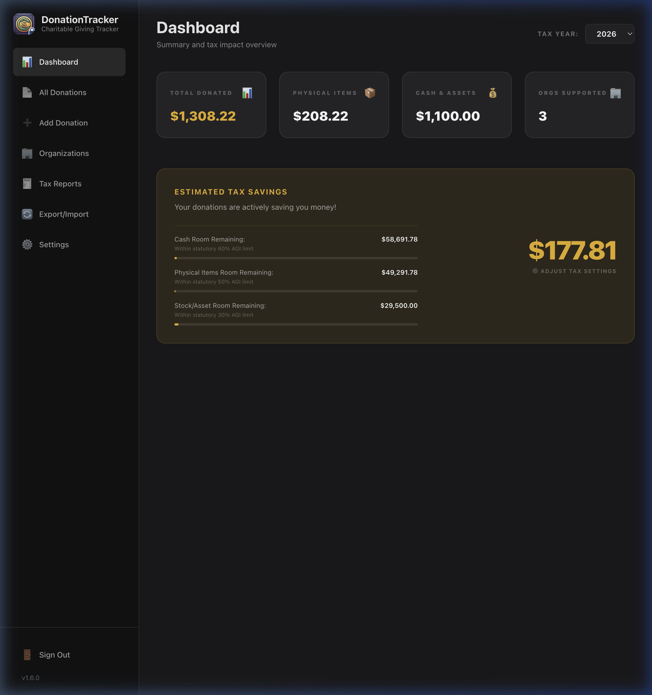

# Donation Tracker

A private, local-first app for tracking charitable donations, built as a modern replacement for Intuit's discontinued **ItsDeductible** service.

Donation Tracker was "vibe-coded" into existence as a personal response to ItsDeductible's retirement. It aims to make tracking item, cash, stock and mileage donations just as easy, while keeping your financial data exactly where it belongs: **on your own machine.**



## ✨ Features

- **Item catalog:** Search more than 1,700 household items with fair market values seeded from ItsDeductible's historical data, or add your own custom items. As prices change, you can [update catalog values from a CSV file](docs/catalog-updates.md).
- **Every kind of donation:** Record physical items, cash, stocks and other assets, and volunteer mileage (including parking and tolls) in one ledger.
- **Organizations:** Keep a directory of the charities you support, with tax IDs and addresses.
- **Receipts and photos:** Attach JPG, PNG or PDF files (up to 10 MB each) to any donation. Files are copied into the app's private storage and cleaned up when the donation is deleted.
- **Dashboard:** See each year's giving at a glance, with totals by donation type and the number of organizations supported.
- **Tax savings estimate:** Enter your estimated AGI and marginal tax rate to see your estimated tax savings. For the 2026 tax year the estimate follows the One Big Beautiful Bill Act (OBBBA) rules, applying the 0.5%-of-AGI deduction floor and showing your remaining room under the 60% (cash), 50% (physical items) and 30% (stocks and assets) AGI ceilings.
- **Annual tax report:** A report grouped by organization and date to help you prepare Form 8283, with a print-friendly layout and CSV export.
- **Sync between machines:** Export everything (catalog, organizations, donations and receipts) to a single `.dtpack` file and merge it into another installation, with duplicate detection and automatic rollback if an import fails.

> [!NOTE]
> Donation Tracker is a record-keeping tool. Its tax figures are estimates, not tax advice.

## 📖 Documentation

- **[Getting Started](docs/getting-started.md):** installation, where your data is stored, and setting up your tax profile.
- **[Using Donation Tracker](docs/user-guide.md):** the dashboard, recording each type of donation, and managing your history.
- **[Reports & Sync](docs/reports-and-sync.md):** annual tax reports, CSV export, and moving data between machines.
- **[Keeping Item Values Current](docs/catalog-updates.md):** updating catalog values from a CSV file, the file format, and a prompt for building one with an AI assistant.

## 🚀 Installation

There are three ways to run Donation Tracker. Whichever you choose, the first time you open it you'll be asked to create the password that protects your data.

### Desktop app (recommended)

Download the installer for your platform from the [latest release](https://github.com/padolph/donation-tracker/releases/latest):

| Platform | File |
| :--- | :--- |
| macOS | `-arm64.dmg` for Apple Silicon, `.dmg` for Intel |
| Windows | `.exe` |
| Linux (Debian/Ubuntu) | `.deb` |

The installers are not code-signed, so macOS and Windows may warn you the first time you open the app.

Your data is stored in your platform's standard application data folder:

| Platform | Location |
| :--- | :--- |
| macOS | `~/Library/Application Support/Donation Tracker` |
| Windows | `%APPDATA%\Donation Tracker` |
| Linux | `~/.config/Donation Tracker` |

That folder holds the database (`production.db`), your settings and hashed password (`config.json`), and attached receipts (`storage/donations/`).

<details>
<summary>Setting the password from the command line instead</summary>

Launch the app once with the `APP_PASSWORD` environment variable. The password is hashed and saved to `config.json`, so later launches don't need it.

- **macOS:**
  ```bash
  APP_PASSWORD=your_password /Applications/Donation\ Tracker.app/Contents/MacOS/Donation\ Tracker
  ```
- **Windows (PowerShell):**
  ```powershell
  $env:APP_PASSWORD="your_password"; & "$env:LOCALAPPDATA\Programs\donation-tracker\Donation Tracker.exe"
  ```
- **Linux:**
  ```bash
  APP_PASSWORD=your_password donation-tracker
  ```
</details>

### Docker (self-hosted)

To run Donation Tracker on a home server or NAS, use the multi-architecture image (`linux/amd64` and `linux/arm64`) published to GitHub Container Registry. These tags are available:

- `latest`: the most recent release
- `vX.Y.Z`: a specific release, for example `v1.9.9`
- `main`: the latest build of the `main` branch

**With Docker Compose**, from a clone of this repository:

```bash
docker compose up -d
```

Edit [`docker-compose.yml`](docker-compose.yml) first to set your options. It runs the `main` image by default.

**With the Docker CLI:**

```bash
docker run -d \
  --name donation-tracker \
  -p 3000:3000 \
  -e APP_PASSWORD="your_secure_password" \
  -e NEXTAUTH_URL="http://<YOUR_SERVER_IP>:3000" \
  -v </path/to/local/storage>:/app/data \
  ghcr.io/padolph/donation-tracker:latest
```

Then open `http://<YOUR_SERVER_IP>:3000` in your browser.

| Setting | Purpose |
| :--- | :--- |
| `APP_PASSWORD` | Your login password. Optional: leave it out to create one in the browser on first launch instead. |
| `NEXTAUTH_URL` | The address you'll open in your browser. Use `http://localhost:3000` on the same machine, or the host's IP address (for example `http://192.168.1.100:3000`) to reach it from other devices. |
| `-v …:/app/data` | A folder on the host that keeps your data between container restarts. |

On first start the container creates the database at `/app/data/production.db`, stores receipts in `/app/data/donations/`, and keeps its settings in `/app/data/config.json`.

To build the image yourself, run `docker build -t donation-tracker .` and use `donation-tracker` as the image name above.

### From source

Requires Node.js 22 or later.

```bash
git clone https://github.com/padolph/donation-tracker.git
cd donation-tracker
npm install
npx prisma migrate dev   # creates prisma/dev.db and seeds the item catalog
npm run dev              # http://localhost:3000
```

To run inside a desktop window instead of a browser, use `npm run desktop:dev`.

In development the database lives at `prisma/dev.db` (set in `.env`) and receipts are saved to `storage/donations/`, so nothing you do here touches the data in an installed copy. The password you create on first launch is saved, hashed, to `.env.local` along with a generated `AUTH_SECRET`.

To package the desktop app for your current platform, run `npm run desktop:build`. The installer is written to `dist/`. The script works on macOS, Linux and Windows. DMG packaging on macOS needs `gettext` (`brew install gettext`).

## 🔒 Security & Privacy

Donation Tracker is built for a single user on a trusted machine.

- **Password-protected:** Every page and action requires signing in with your password. There is one password and no user accounts.
- **No plaintext password:** The password is stored only as a salted `scrypt` hash.
- **Local only:** Your ledger and receipts stay on your disk. The app never uploads your data anywhere.
- **No encryption at rest:** The SQLite database and receipt files are stored unencrypted. The app does not protect against someone with administrator or physical access to your machine. If you need that, use your operating system's disk encryption (FileVault on macOS, BitLocker on Windows, or dm-crypt/LUKS on Linux).

## 🛠️ Tech Stack

- [Next.js](https://nextjs.org/) (App Router) with React and [Tailwind CSS](https://tailwindcss.com/)
- [SQLite](https://sqlite.org/) via [Prisma ORM](https://www.prisma.io/)
- [Auth.js](https://authjs.dev/) (NextAuth) for sign-in
- [Electron](https://www.electronjs.org/) for the desktop app, which runs the Next.js server inside the app
- [Jest](https://jestjs.io/) and React Testing Library for tests

## 🤝 Contributing

Contributions are welcome. See [CONTRIBUTING.md](CONTRIBUTING.md) for the development workflow, testing and commit conventions. Before opening a pull request, run:

```bash
npm test
npm run lint
```

## 📄 License

[MIT](LICENSE) © Paul Adolph
