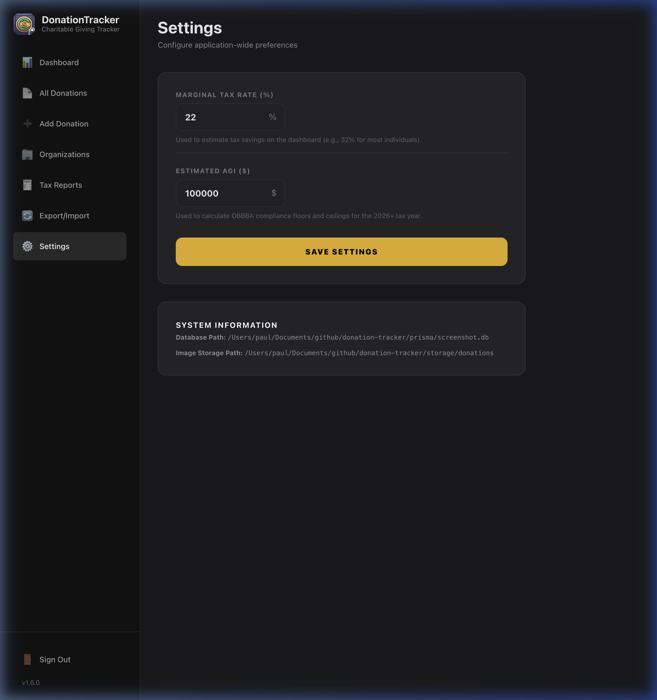

# Getting Started

Welcome to the **Donation Tracker** User Guide. Donation Tracker is a secure, local-first application designed to help you organize and track your charitable giving—including physical items, cash, and assets—while calculating your tax deductions.

---

## Installation & Setup

Donation Tracker runs locally on your machine to ensure your financial data remains private. You can run it in two ways:

### 1. Standalone Desktop App (Electron)
If you are running the packaged Electron app, simply launch the app executable. 

> [!NOTE]
> On the first launch, the application will walk you through a setup wizard to create a local access password. This password prevents unauthorized access to your ledger on your machine.

If you need to configure or update your password in the packaged app, launch it from your command line once with the `APP_PASSWORD` environment variable:
* **macOS:** `APP_PASSWORD=your_password /Applications/Donation\ Tracker.app/Contents/MacOS/Donation\ Tracker`
* **Windows (PowerShell):** `$env:APP_PASSWORD="your_password"; & "$env:USERPROFILE\AppData\Local\Programs\donation-tracker\Donation Tracker.exe"`
* **Linux:** `APP_PASSWORD=your_password donation-tracker`

### 2. Self-Hosted / Docker
For a lightweight standalone setup (ideal for home servers or NAS), you can use Docker:
```bash
docker run -d \
  --name donation-tracker \
  -p 3000:3000 \
  -e APP_PASSWORD=your_secure_password \
  -v /path/to/host/data:/app/data \
  ghcr.io/padolph/donation-tracker:latest
```
Then navigate to `http://localhost:3000` in any web browser.

---

## Local Storage Locations

Because Donation Tracker is offline-first, your database and uploaded receipts are stored directly on your hard drive. 

### Database & Configuration Paths
The local SQLite database and configuration files are stored in the following platform-standard directories:

| Platform | Database Location | Configuration File |
| :--- | :--- | :--- |
| **macOS** | `~/Library/Application Support/Donation Tracker/production.db` | `config.json` |
| **Windows** | `%APPDATA%\Donation Tracker\production.db` | `config.json` |
| **Linux** | `~/.config/Donation Tracker/production.db` | `config.json` |
| **Docker** | `/app/data/production.db` (inside the container) | Managed via environment variables |

### Receipt Image Directories
When you attach receipt images or photos to your donations, the files are copied into a local directory to ensure they remain accessible if you delete the source files:
* **Desktop App:** Copied to the `receipts` subfolder inside the platform's application support directory.
* **Docker Container:** Saved in `/app/data/donations`.

---

## Setting Up Your Tax Profile (Settings Page)

To enable the tax savings engine on your dashboard, you must configure your tax profile on the **Settings** page.

1. **Marginal Tax Rate (%):** Enter your overall federal/state marginal tax rate (e.g., `22` or `32`).
2. **Estimated AGI ($):** Enter your estimated Adjusted Gross Income for the current tax year.

These values are saved securely in your local database and are used to calculate progress indicators, floors, and ceilings.



---

## Understanding OBBBA Tax Compliance (2026+)

Donation Tracker features a decoupled, year-specific tax calculator architecture. When the tax year dropdown is set to **2026 or later**, calculations comply with the **One Big Beautiful Bill Act (OBBBA)** core regulatory rules:

### 1. The 0.5% AGI Floor
Under OBBBA rules, tax-deductible giving only begins *after* your cumulative contributions exceed a baseline floor of **0.5% of your AGI**:
$$\text{Floor} = \text{Estimated AGI} \times 0.005$$
* *Example:* If your AGI is \$100,000, your floor is \$500. The first \$500 of your total annual giving is not tax-deductible. The tax savings are calculated only on the portion of giving that *exceeds* this floor.

### 2. The 35% High-Earner Benefit Cap
If your configured Marginal Tax Rate is **37%**, the OBBBA calculator automatically limits your effective deduction rate to **35%** for charitable contributions.

### 3. Asset-Specific Ceilings
The calculator enforces strict annual limits on the amount of deductions you can claim based on your Estimated AGI:
* **Cash & Stock/Asset Donations:** Capped at **60% of AGI**.
* **Physical Item Donations:** Capped at **30% of AGI**.

*If your total giving exceeds these ceilings, the application caps your on-screen tax savings and notes that the remaining amount will carry forward.*
