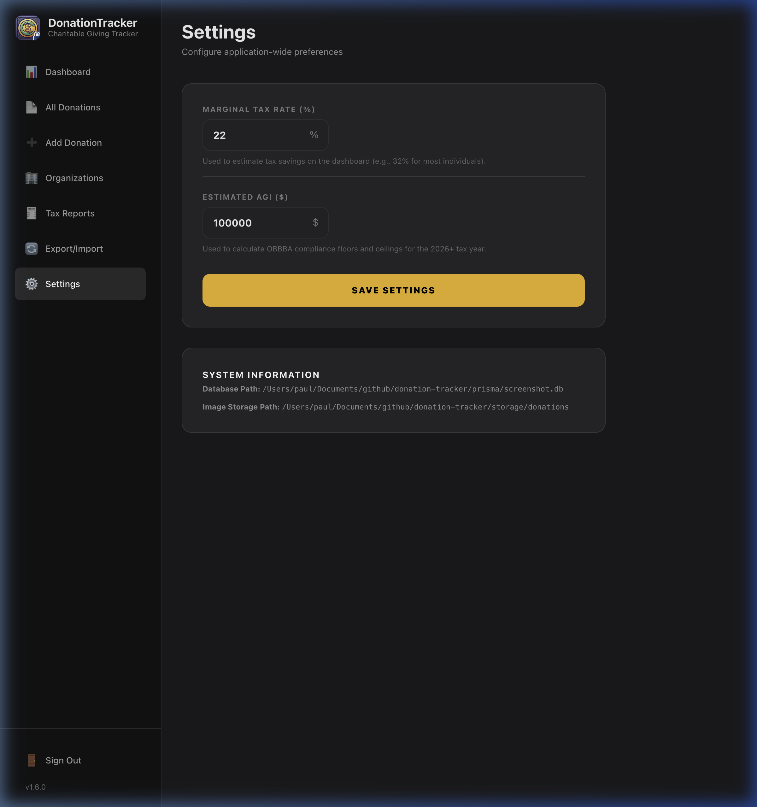

# Getting Started

Welcome to the **Donation Tracker** User Guide. Donation Tracker is a secure, local-first application designed to help you organize and track your charitable giving—including physical items, cash, and assets—while calculating your tax deductions.

---

## Installation & Setup

Donation Tracker runs locally on your machine to ensure your financial data remains private. You can run it in two ways:

### 1. Standalone Desktop App (Electron)
If you are running the packaged Electron app, simply launch the app executable. 

> [!NOTE]
> On the first launch, the application will walk you through a setup wizard to create a local access password. This password prevents unauthorized access to your ledger on your machine.

If you need to configure or update your password in the packaged app, launch it from your command line once with the `APP_PASSWORD` environment variable:
* **macOS:** `APP_PASSWORD=your_password /Applications/Donation\ Tracker.app/Contents/MacOS/Donation\ Tracker`
* **Windows (PowerShell):** `$env:APP_PASSWORD="your_password"; & "$env:USERPROFILE\AppData\Local\Programs\donation-tracker\Donation Tracker.exe"`
* **Linux:** `APP_PASSWORD=your_password donation-tracker`

### 2. Self-Hosted / Docker
For a lightweight standalone setup (ideal for home servers or NAS), you can use Docker.

#### Option A: Using Docker Compose (Recommended)
If you have cloned the repository, you can start the application using the preconfigured `docker-compose.yml` file:

1. **Start the container:**
   ```bash
   docker compose up -d
   ```
2. **Configure:**
   You can customize the following variables directly inside the `docker-compose.yml` file:
   * **`APP_PASSWORD`**: The master password used to log in. Change `your_secure_password` to your own password.
   * **`NEXTAUTH_URL`**: Set to `http://localhost:3000` by default. For network access from other machines, change `localhost` to the host's local IP address (e.g. `http://192.168.1.100:3000`).
   * **`volumes`**: Mounts `./local-data` in the host directory to `/app/data` inside the container, preserving your database and uploads.

#### Option B: Running via Docker CLI
If you prefer running a single ad-hoc command:
   ```bash
   docker run -d \
     --name donation-tracker \
     -p 3000:3000 \
     -e APP_PASSWORD="your_secure_password" \
     -e NEXTAUTH_URL="http://<YOUR_SERVER_IP>:3000" \
     -v </path/to/local/storage>:/app/data \
     ghcr.io/padolph/donation-tracker:main
   ```   
   * **`APP_PASSWORD`**: The master password you will use to log into the application.
   * **`NEXTAUTH_URL`**: **(Required for Network Access)** Replace `<YOUR_SERVER_IP>` with the local IP address of the machine running Docker (e.g., `192.168.1.100`). NextAuth uses this to securely sign tokens and handle internal redirects. If you only intend to access the app on the same machine running Docker, you can use `http://localhost:3000`.
   * **`-v` (Volume Mount)**: Replace `</path/to/local/storage>` with the absolute path to a folder on your host machine where you want your SQLite database and uploaded attachments to live permanently.

Then navigate to `http://<YOUR_SERVER_IP>:3000` (or `http://localhost:3000`) in any web browser.

---

## Local Storage Locations

Because Donation Tracker is offline-first, your database and uploaded receipts and photos are stored directly on your hard drive. 

### Database & Configuration Paths
The local SQLite database and configuration files are stored in the following platform-standard directories:

| Platform | Database Location | Configuration File |
| :--- | :--- | :--- |
| **macOS** | `~/Library/Application Support/Donation Tracker/production.db` | `config.json` (same folder) |
| **Windows** | `%APPDATA%\Donation Tracker\production.db` | `config.json` (same folder) |
| **Linux** | `~/.config/Donation Tracker/production.db` | `config.json` (same folder) |
| **Docker** | `/app/data/production.db` (inside the container) | `/app/data/config.json` (inside the container) |

The `config.json` file holds the app's generated sign-in secret and your password hash. In Docker, the `APP_PASSWORD` environment variable is hashed at startup, and a password saved in `/app/data/config.json` takes precedence over it. Because both files live under `/app/data`, the volume mount keeps them across container restarts.

### Receipt Image Directories
When you attach receipt images or photos to your donations, the files are copied into a local directory to ensure they remain accessible if you delete the source files:
* **Desktop App:** Copied to the `storage/donations` subfolder inside the application data folder listed above (for example, `~/Library/Application Support/Donation Tracker/storage/donations` on macOS).
* **Docker Container:** Saved in `/app/data/donations`.

---

## Setting Up Your Tax Profile (Settings Page)

To enable the tax savings engine on your dashboard, you must configure your tax profile on the **Settings** page.

1. **Marginal Tax Rate (%):** Enter your overall federal/state marginal tax rate (e.g., `22` or `32`).
2. **Estimated AGI ($):** Enter your estimated Adjusted Gross Income for the current tax year.

These values are saved securely in your local database and are used to calculate progress indicators, floors, and ceilings.



---

## Understanding OBBBA Tax Compliance (2026+)

Donation Tracker features a decoupled, year-specific tax calculator architecture. When the tax year dropdown is set to **2026 or later**, calculations follow the **One Big Beautiful Bill Act (OBBBA)** rules described below. For earlier years, the dashboard uses a simple estimate: total giving × your marginal tax rate, with no floor or ceilings.

### 1. The 0.5% AGI Floor
Under OBBBA rules, tax-deductible giving only begins *after* your cumulative contributions exceed a baseline floor of **0.5% of your AGI**:

**Floor** = Estimated AGI × 0.005

* *Example:* If your AGI is \$100,000, your floor is \$500. The first \$500 of your total annual giving is not tax-deductible. The tax savings are calculated only on the portion of giving that *exceeds* this floor.

### 2. AGI Ceilings
Annual deduction limits are based on your Estimated AGI and are applied in order, following IRS Publication 526. Each category's limit is reduced by what the earlier categories already used:

1. **Stock & Asset Donations:** Up to **30% of AGI**.
2. **Physical Item Donations:** Up to **50% of AGI**, minus the stock and asset amount counted in step 1.
3. **Cash Donations:** Up to **60% of AGI**, minus the stock, asset and item amounts counted in steps 1 and 2.

The dashboard shows how much room is left in each category. When a category reaches its limit, it is marked as maximized. Giving above a limit is not deductible this year and can carry forward for up to five years, so it does not count toward this year's savings:

**Estimated Tax Savings** = the smaller of (Total Giving − Floor) and (Giving Within the Ceilings), × Marginal Tax Rate

* *Example:* With an AGI of \$100,000 and \$70,000 of cash giving, the cash ceiling is \$60,000. Savings at a 32% rate are \$60,000 × 0.32 = \$19,200, and the remaining \$10,000 carries forward.

### 3. High-Earner Benefit Cap (37% Bracket)
OBBBA limits the tax benefit of itemized deductions for taxpayers in the top 37% bracket. Their deduction is reduced by 2/37, so each deductible dollar saves at most 35 cents. When your marginal tax rate is set to 37% or higher, the dashboard applies this reduction:

**Estimated Tax Savings** = Deductible Amount × 35/37 × Marginal Tax Rate

* *Example:* With an AGI of \$100,000, \$1,500 of cash giving and a 37% rate, the deductible amount is \$1,000. Savings are \$1,000 × 35/37 × 0.37 = \$350, not \$370.
* This is an estimate. The actual reduction depends on how much of your taxable income falls in the 37% bracket, so check the final figure with your tax preparer.
