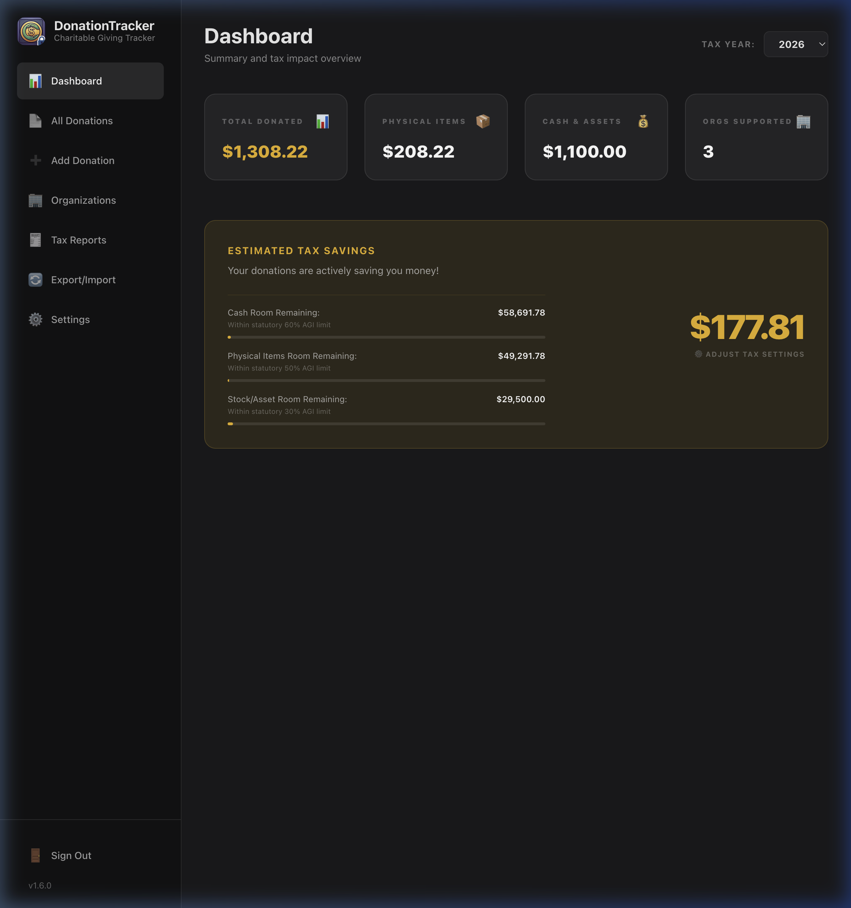
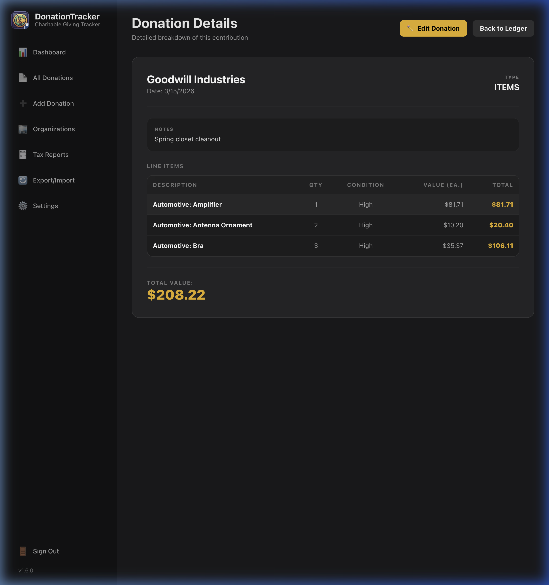

# Using Donation Tracker

This guide details how to navigate the dashboard, record new donations (items, cash, and stocks), manage your donation history, and organize your list of charities.

---

## The Dashboard

The Dashboard provides a high-level summary of your giving for any selected tax year. You can toggle the active year using the **Tax Year** dropdown at the top right of the page.

### Tax Savings States
The **Estimated Tax Savings** card dynamically calculates your potential tax benefit based on your settings (Estimated AGI and Marginal Tax Rate) and your total contributions. It will display one of three regulatory states:

#### State 1: Below the Floor
* **Total Giving:** Less than or equal to your 0.5% AGI Floor.
* **Calculated Savings:** `$0.00`
* **On-Screen Helper Text:** *`"You are $X away from clearing your statutory 2026 0.5% AGI floor ($Y). Once crossed, your giving will begin unlocking tax savings."`*
* **What it means:** You must cross the floor first. Once cumulative giving exceeds this floor, savings start accruing on any additional contributions.

#### State 2: In the Active Zone
* **Total Giving:** Greater than the floor but less than the regulatory ceiling.
* **Calculated Savings:** Calculated tax savings based on your effective rate, applied *only* to the amount of giving that exceeds the floor.
* **On-Screen Helper Text:** *`"Your donations are actively saving you money! You can log another $Z in contributions before hitting your annual AGI deduction limit."`*
* **What it means:** Your giving is actively reducing your tax liability.

#### State 3: Above the Ceiling
* **Total Giving:** Exceeds the annual regulatory limits (30% AGI for items, 60% AGI for cash/assets).
* **Calculated Savings:** Capped strictly at the maximum allowable deduction threshold.
* **On-Screen Helper Text:** *`"You have fully maximized your allowable 2026 deductions. Remaining tracked balances will carry forward as future tax assets."`*

---

## Creating a New Donation

To log a donation, navigate to **New Donation** in the sidebar.

### Step 1: Select or Create an Organization
* Choose a charity from the **Organization** dropdown.
* If the organization is not listed, click the **Add Organization** link next to the dropdown. Provide the organization name, address, and Tax ID/EIN to save it permanently for future use.

### Step 2: Choose Donation Type
Select the tab corresponding to the type of donation you are recording:

#### 1. Physical Items (Non-Cash)
Item donations use the built-in valuation engine to calculate Fair Market Value (FMV) based on standard thrift shop values:
* **Search Catalog:** Type the name of an item in the search field (e.g., "shirt", "coat", "cookware"). The application queries the catalog of 1,700+ seeded items and displays matches.
* **Browse Categories:** Click through the hierarchical category browser to find items manually.
* **Select Condition:** Choose either **High** (excellent condition) or **Medium** (good condition). The default prices for that catalog item will automatically populate.
* **Add Custom Items:** If your item is unique or not present in the catalog, click **Add Custom Item**. Enter a description, set default values for High/Medium conditions, and save it. It will be added to your database and will appear in searches going forward.
* **Staging List:** Enter the quantity and click **Add Item**. The item is added to the staging table. You can add multiple items to a single donation. A running total shows the cumulative donation value in real-time.

#### 2. Cash Donations
For direct cash, check, or online monetary donations:
* Enter the cash amount directly in the **Amount ($)** field.
* Add optional notes (e.g., "Annual Gala contribution").

#### 3. Stock / Asset Donations
For transfers of stock or other securities:
* **Stock Ticker:** Enter the public market ticker symbol (e.g., `MSFT`, `AAPL`).
* **Shares:** Enter the number of shares transferred (this is stored as informational metadata).
* **Value on Transfer Date:** Enter the total Fair Market Value of the transferred securities on the date of the donation.

### Step 3: Attach Receipts & Photos
For physical proof of your donation (e.g., a paper receipt or photo of the items):
* Click the file upload button on the donation builder page.
* Select an image file (PNG, JPG/JPEG, PDF).
* The application copies the image to a secure local folder and stores its relative path. 

### Step 4: Save Donation
Click **Save Donation** to commit the event to the ledger. This permanently locks in the item valuation and saves all attached photo paths.

---

## Managing Your Ledger & History

Navigate to **All Donations** in the sidebar to show the central *Donation Ledger*, where all recorded donations are listed.

* **Viewing past donations:** The ledger table lists events chronologically with details (Date, Organization, Type, and Total Value).
* **Filtering:** Use the filters at the top of the ledger to filter by tax year or receiving organization.
* **Expanding Details:** Click the *Expand* button on any donation row to expand it. This shows the line-item breakdown (for physical items) and displays clickable previews of any attached receipt image.
* **Editing a Donation:** To change an entry, click the **Edit Donation** button in the expanded view. This opens a view where you can change the donation data, including modifying items, adjusting values, adding or removing attachments, or changing the receiving organization.
* **Deleting a Donation:** Click the delete icon in the ledger. If deleted, the database record is removed. The application also automatically deletes any image files associated with the donation.

---

## Managing Organizations

To keep your organization data clean, go to **Organizations** in the sidebar.
* **View list:** Displays all saved charities, their details (address, Tax ID), and the cumulative total you have donated to each.
* **Add / Edit:** Update details like the charity’s address or Employer Identification Number (EIN) for tax filing.
* **Delete:** Remove a charity from your directory. If you try to delete an organization with active donations in your ledger, the system will display a warning to prevent accidental loss of data.
